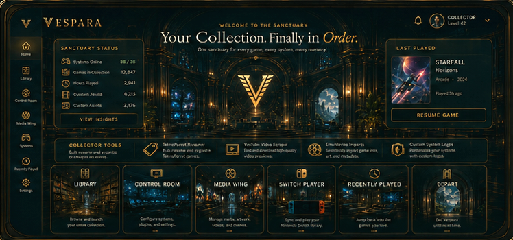

# Vespara

### A controller-first living world for entering, exploring, and launching your game collection.

Vespara turns a traditional game launcher into a navigable world. Begin in **The Sanctuary**, drift through **Attract Mode**, browse **The Library**, configure your setup in **The Control Room**, or change travelers at the **Traveler Gate**.

## Why Vespara

Vespara is designed to feel like a place to return to, not a wall of software menus. Its spaces provide a calm, controller-first way to discover games, launch them, and maintain the systems behind them.

### Highlights

- Controller-first navigation with keyboard support and predictable focus restoration.
- A living Sanctuary home with Recently Played, destination spaces, and subtle reduced-motion-safe atmosphere.
- Cinematic Attract Mode for ambient discovery between sessions.
- Library browsing, collections, archive views, game launch, and AI Game Coach guidance.
- Control Room systems, archives, media restoration, emulator, path, controller, and display tools.
- English and Spanish localization.

## Vespara 6.0.5 — Sanctuary and Attract Mode polish

**Current version: v6.0.5**

The current release refines environmental motion, cinematic transitions, Sanctuary language, and Spanish status values.
The installation and release details below are verified against Vespara 6.0.5.

Download it from the [GitHub release](https://github.com/romeclientel1/nuarcade/releases/tag/v6.0.5):

`Vespara.Setup.6.0.5.exe`

## Installation

1. Download `Vespara.Setup.6.0.5.exe` from [Releases](https://github.com/romeclientel1/nuarcade/releases).
2. Run the installer and choose an installation directory if needed.
3. Launch Vespara and complete Traveler Recognition.
4. Configure emulator and game paths in the Control Room.

Vespara does not include games, ROMs, BIOS files, firmware, keys, or emulator binaries. You provide and configure those separately.

### Important: unsigned installer

Vespara’s Windows installer is currently unsigned. Windows may display a SmartScreen warning. Download releases only from this repository and verify the published SHA-256 checksum before running the installer. Do not treat bypassing SmartScreen as automatically safe.

For 6.0.5, the published SHA-256 is:

`027954439A5523AADBE5847BCB15C5619F7B1AAB3CD49D40535CA960F1856CAA`

## Current scope

- Windows 10 or 11, 64-bit, is the current supported release platform.
- Vespara is actively evolving; interfaces, supported systems, and setup guidance may change between releases.
- Emulator, firmware, BIOS, key, game, and media setup remains the operator’s responsibility.
- The installer is unsigned, as noted above.

## The Sanctuary

The Sanctuary is Vespara’s home. It surfaces Recently Played games and destinations that feel like connected places:

| Destination | What it does |
|---|---|
| The Library | Browse, organize, and launch your collection |
| The Control Room | Configure systems, paths, controllers, display, and media |
| Traveler Gate | Choose another traveler |
| Depart | Close Vespara, with a confirmation step |

## The Library and Control Room

The Library supports system browsing, search, sorting, favorites, Collections, Archive View, launch options, and AI Game Coach guidance. The Control Room brings systems and archives together for emulator, path, controller, launch, display, artwork, video, scraping, bezel, and media-restoration work.

See the [Owner’s Manual](USER_MANUAL.md) for setup and day-to-day instructions.

## Supported systems

Vespara currently supports 20 system families, including Arcade, PlayStation 3, Xbox 360, GameCube/Wii, PlayStation 2, Nintendo Switch, Nintendo 64, PlayStation, Dreamcast/NAOMI, Original Xbox, PSP, Wii U, Sega Model 2/3, Pinball, Steam, PC Games, and classic systems through RetroArch.

The complete emulator matrix is maintained in the [Owner’s Manual](USER_MANUAL.md#12-supported-systems).

## Quick controls

| Key | Action |
|---|---|
| Left / Right Arrow | Previous / next game |
| Enter | Open Archive View |
| Space | Launch the selected game |
| F | Toggle favorite |
| C | Open AI Game Coach |
| Esc | Back / close overlay |

The [Owner’s Manual](USER_MANUAL.md#11-keyboard-and-controller-reference) contains the full keyboard and controller reference.

## Updates and documentation

Vespara checks for an update once per session. After an update, it may close and need to be reopened manually. See the [Owner’s Manual](USER_MANUAL.md#9-updating-vespara) for details.

- [Owner’s Manual](USER_MANUAL.md) — setup, destinations, controls, and troubleshooting.
- [Releases](https://github.com/romeclientel1/nuarcade/releases) — installers, checksums, and release notes.

## Acknowledgments

Vespara was developed with design, planning, testing, and implementation assistance from ChatGPT by OpenAI.

## License

This repository’s `package.json` declares an MIT license, but no standalone `LICENSE` file currently exists in the repository.
